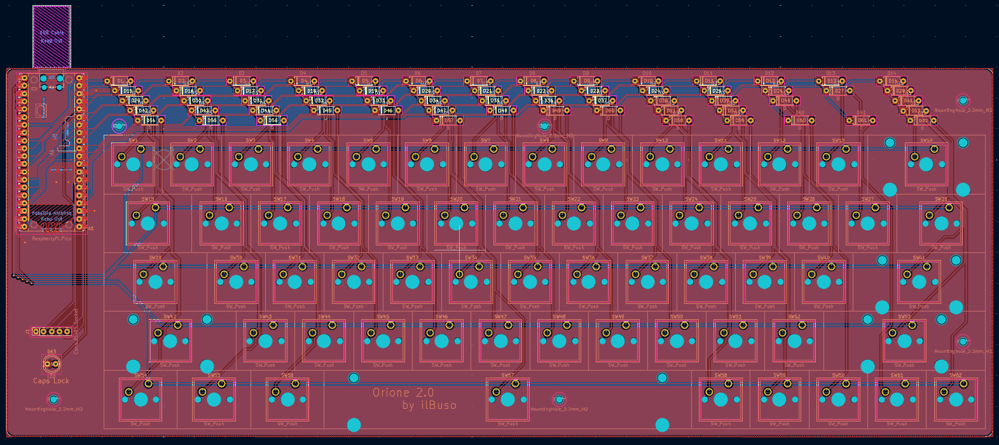

# Orione

Orione is a custom 60% mechanical keyboard powered by Raspberry Pi Pico.

## Table of Contents

- [About the Project](#about-the-project)
- [Key Features](#key-features)
- [Making It Your Own](#making-it-your-own)
- [What You'll Need](#what-youll-need)
  - [Hardware Components](#hardware-components)
  - [Software Tools](#software-tools)
- [The PCB](#the-pcb)
- [The Chassis](#the-chassis)
- [Project layout](#project-layout)
- [Video and Presentation](#video-and-presentation)
- [The Team](#the-team)

## About the Project

The need for a keyboard with a rotary encoder that could be customized without compromising on functionality sparked the creation of this project. When existing options fell short of meeting these requirements, Orione was born: a custom 60% mechanical keyboard powered by the Raspberry Pi Pico, featuring fully customizable firmware and a dual-layer system that packs maximum functionality into a minimal footprint.

Orione is built around the compact 60% keyboard layout, which strips away the function row and number pad to create a more ergonomic typing experience. At its heart is the Raspberry Pi Pico microcontroller, an affordable and reliable brain that handles everything from key presses to USB communication.

What makes Orione special is its programmable dual-layer system. Through a dedicated function key, you can access an entirely separate layer of key functions, meaning you don't lose any functionality despite the smaller form factor. It's like having two keyboards in one compact package.

## Key Features

The design philosophy behind Orione was simple: create something that feels personal and works exactly the way I want it to. Here's what that translated into:

The **60% layout** keeps everything within easy reach, no more stretching for distant keys or function rows. A **dual-layer system** accessed through a dedicated function key means I haven't sacrificed any functionality for compactness.

The **rotary encoder** handles volume control beautifully, with raise, lower, and mute functionality at your fingertips. There's also a **Caps Lock LED indicator** for quick visual feedback.

For switches are for the most part **Gateron Yellow switches** that provide smooth linear action for most keys, while **Gateron Blue switches** offer tactile feedback on select keys where I wanted that extra confirmation.

Most importantly, the firmware is **fully customizable**. Every key can be remapped, every function can be changed. The Raspberry Pi Pico makes this possible, and the open-source nature of the project means you're never locked into my choices.

## Making It Your Own

One of Orione's defining features is how easily you can make it yours. The firmware is completely open and modifiable. Want to change what a key does? Remap the function layer? It's all possible:

Start by editing the keymap configuration files to match your preferences. Once you're happy with your changes, recompile the firmware and flash it to your Raspberry Pi Pico. That's it, you've got a personalized keyboard that works exactly the way you want it to.

## What You'll Need

### Hardware Components

Building Orione requires a carefully selected set of components. You'll need a **Raspberry Pi Pico** as the microcontroller, it's the brain of the operation. The **rotary encoder** provides that tactile volume control I was after, while a **220Ω resistor** limits current to the **LED** that serves as the Caps Lock indicator.

For the switches, you'll need **62 mechanical switches** total. You'll also need a matching set of **62 keycaps** and **62 diodes** for the key matrix.

Finally, there's the **custom PCB** that I designed specifically for this project, bringing all these components together in a compact and functional layout.

### Software Tools

The development environment revolves around **VS Code**, which I used for writing and debugging the firmware. For the PCB design, **KiCad** handled both the schematics and the layout. The chassis and 3D components were modeled in **Blender**.

On the firmware side, the project uses the **Raspberry Pi Pico C/C++ SDK**, following the official _Getting Started guide_ will get you set up properly. The **TinyUSB Library** is crucial here, as it enables USB HID communication between the Pico and your computer through the micro USB port, making the keyboard actually function as, well, a keyboard.

## The PCB



## The Chassis

## Project layout

```
/
├───datasheets
|   └───...
├───firmware
│   ├───config
│   └───src
│       ├───init
│       │   ├───init.h
│       │   └───init.c
│       ├───interrupts
│       │   ├───interrupts.h
│       │   └───interrupts.c
│       ├───matrix
│       │   ├───keymap
│       │   │   ├───keymap.h
│       │   │   └───keymap.c
│       │   └───scan_rows
│       │       ├───scan_rows.h
│       │       └───scan_rows.c
│       ├───rotary_encoder
│       │   ├───rotary_encoder.h
│       │   └───rotary_encoder.c
│       └───usb
│           ├───usb_callbacks
│           │  ├───usb_callbacks.h
│           │  └───usb_callbacks.c
│           └───usb_descriptors
│              ├───usb_descriptors.h
│              └───usb_descriptors.c
├───pcb
│    └───orione-v2
│        └───...
└───chassis
    └───...
```

## Video and Presentation

[Video]()

[Presentation]()

## The Team

In the team we collaborated closely with eachother, both in presence and through Github.

|Name|Github handle|
|---|---|
|Alessandro Busola| [@ilBuso](https://github.com/ilBuso)|
|Giulio Pimenoff Verdolin|[@Giuliopime](https://github.com/Giuliopime)|
|Michele Pezzo|[@MichelePZZ](https://github.com/MichelePZZ)|
|Daniel Biz|[@BizDaniel](https://github.com/BizDaniel)|