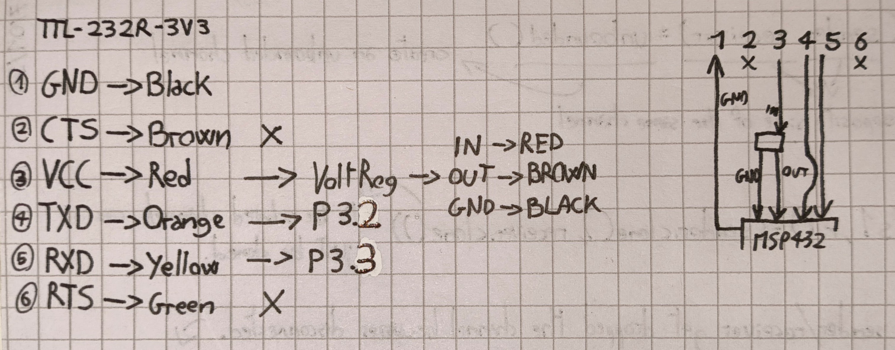

# Orione

```bash
sudo modprobe uinput 

sudo ./vk
```
---
## hardware
### keyboard matrix  
A keyboard matrix is a method used to connect multiple switches to a MCU while minimizing the number of GPIO pins required. Instead of connecting each key to a separate pin, the keys are arranged in a grid-like pattern, reducing the number of connections needed.

MCU, including the MSP432, have a limited number of GPIO pins. If each key were connected to its own pin, we would quickly run out of available pins, especially for large keyboards. By organizing the keys into a matrix configuration, we can efficiently read the state of many switches using fewer pins.

  
For this particular setup, we use a 6-row by 17-column matrix, allowing us to control and read up to 102 keys while only using 23 GPIO pins instead of 102.    

- Rows (6 total) → Configured as Outputs  
  These pins are set as outputs, driving signals into the matrix to scan for key presses.

- Columns (17 total) → Configured as Inputs  
  These pins are set as inputs with internal pull-Up resistors to detect changes when a key is pressed.

### UART
(Universal Asynchronous Receiver-Transmitter) is a hardware communication protocol that enables asynchronous serial communication between devices. It transmits data one bit at a time without requiring a shared clock signal. Instead, it uses start and stop bits to frame the data, along with optional parity for error detection.  

We use UART because we don't have a valid USB module (which would have made things simpler but where's the fun in that).

**Pin Functions**
1. `GND`: Is the **Ground**, this is the common ground reference for all the signals. It must be connected between the computer and the MCU.
2. `CTS`: Is the **Clear to Send**, this is a flow control pin (**WE DON'T USE IT**). When using hardware flow control, the **receiver** pulls this pin **LOW (0V)** to signal that it is ready to receive data.
3. `VCC`: Is the **Power Delivery**, this pin provides power from the computer to the MCU. The voltage level depends on the cable, in our case is 5V.
4. `TXD`: Is the **Transmit Data**, this is the data output from the computer to the MCU. The computer sends data on this pin, and the MCU receives it on its **RXD** pin.
5. `RXD`: Is the **Receive Data**, this is the data input to the computer from the MCU. The MCU sends data on this pin, and the computer receives it on its **TXD** pin.
6. `RTS`: Is the **Request to Send**, this is a flow control pin (**WE DON'T USE IT**). The transmitter pulls this pin **LOW (0V)** to request permission to send data.

**Connections**
- `GND` ↔ `GND`
- `TXD` ↔ `RXD`
- `RXD` ↔ `TXD`
- `VCC` ↔ `3V3`

### power
The cable other than UART communication does also power delivery, not at 3V3 but at 5V so we use a voltage regulator that brings down the voltage to 3V3.

### rotary encoder
TODO

### display  
TODO

---
## firmware
### interrupts
TODO: Interrupts setup & keyboard matrix logic

### mechanical debouncing
Because the electrical components may accidentally make multiple distinct contacts on a single switch press we have a minimal debouncing implementation in the firmware.  
For each key we have a key state, in which we store a timestamp (possibly 0) indicating the last time it was pressed.  
On each key press event we receive (from the interrupts and keyboard matrix logic described above) we get the timestamp of the last press. If 0 then we send the event via uart, otherwise we calculate the difference between the current timestamp and the last one. If it's below a certain threshold (20ms) then the event is valid and we update the timestamp to the current one, otherwise we ignore it.

### uart
Basic uart configuration and usage

## driver
### permissions
- Windows: may need Administrator permissions (to test)
- Linux: needs access to dev/uinput (typically root)
- macOS: needs accessibility permissions

### uart receiver

### rate limiting

### os keycode conversion

### note about modifier keys

---  
**resources**
- https://github.com/bschwind/key-ripper/tree/main