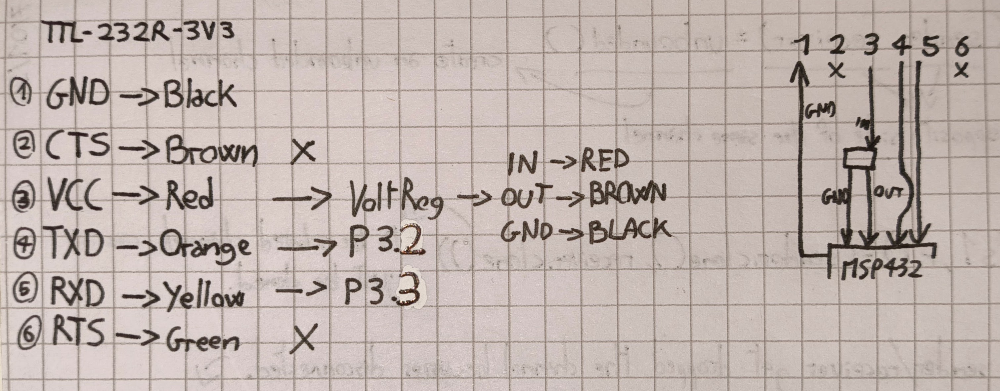
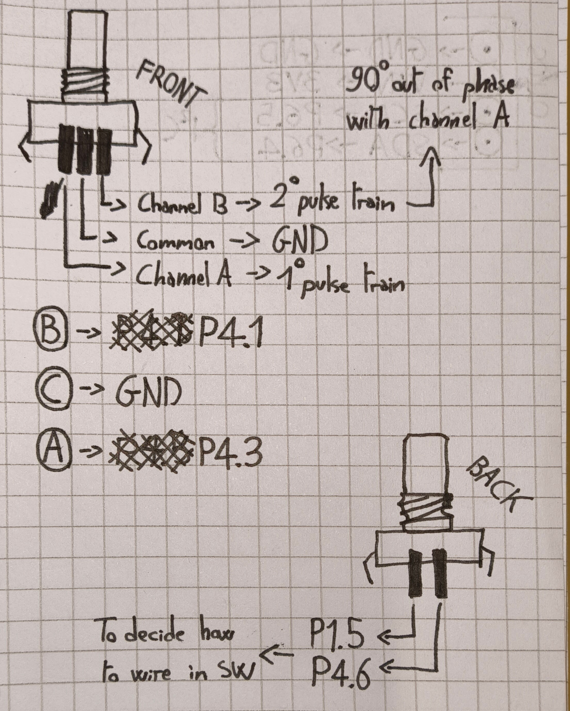
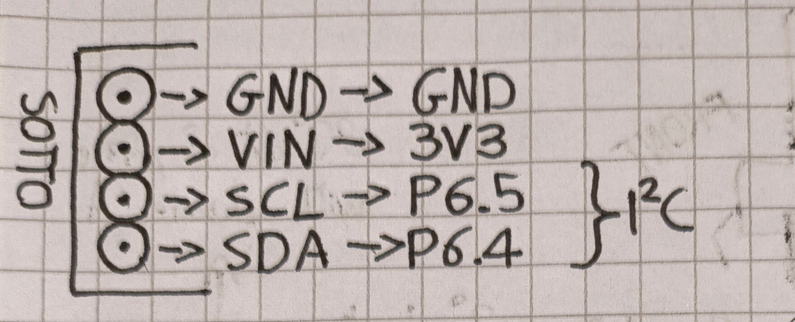
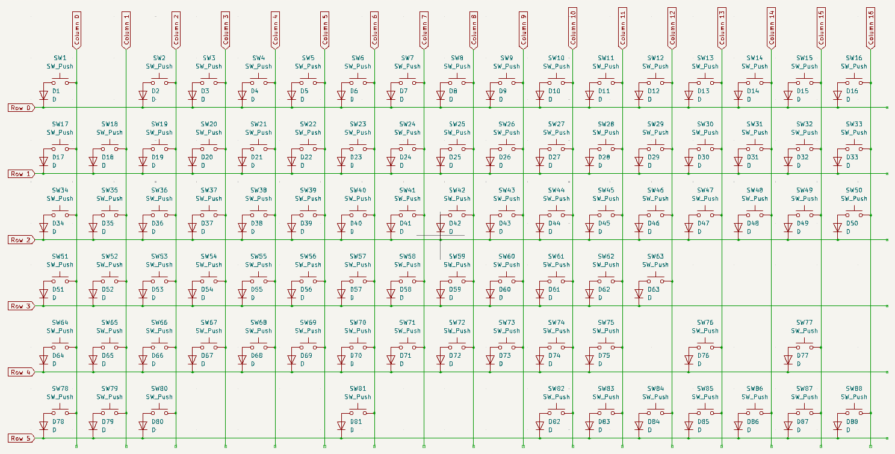

# UART
**UART** (**Universal Asynchronous Receiver-Transmitter**) is a hardware communication protocol that enables asynchronous serial communication between devices. It transmits data one bit at a time without requiring a shared clock signal. Instead, it uses start and stop bits to frame the data, along with optional parity for error detection.

## Pin Functions
1. `GND`: Is the **Ground**, this is the common ground reference for all the signals. It must be connected between the computer and the MCU.

2. `CTS`: Is the **Clear to Send**, this is a flow control pin (**WE DON'T USE IT**). When using hardware flow control, the **receiver** pulls this pin **LOW (0V)** to signal that it is ready to receive data.

3. `VCC`: Is the **Power Delivery**, this pin provides power from the computer to the MCU. The voltage level depends on the cable, in our case is 5V.

4. `TXD`: Is the **Transmit Data**, this is the data output from the computer to the MCU. The computer sends data on this pin, and the MCU receives it on its **RXD** pin.

5. `RXD`: Is the **Receive Data**, this is the data input to the computer from the MCU. The MCU sends data on this pin, and the computer receives it on its **TXD** pin.

6. `RTS`: Is the **Request to Send**, this is a flow control pin (**WE DON'T USE IT**). The transmitter pulls this pin **LOW (0V)** to request permission to send data.

## Connections
- `GND` ↔ `GND`  
- `TXD` ↔ `RXD`  
- `RXD` ↔ `TXD`  
- `VCC` ↔ `3V3`

## Firmware
In the Software when a key press is detected the corresponding signal is sent via the UART

# Rotary Encoder
A rotary encoder is a sensor that detects rotation and converts it into an electrical signal. The rotary encoder i have selected also acts like a switch so other than be rotated it can also be pressed

## Pin Functions
1. `Channel A`: Outputs a pulse signal when the encoder is rotated.
2. `Channel B`: Outputs a pulse signal slightly out of phase with Channel A (if i read the data-sheet correctly it is 90° out of phase with **channel A**)
3. `Common`: GND
4. `SW_1_PIN`: Normal switch header
5. `SW_2_PIN`: Normal switch header

# OLED Display
The OLED Display uses I2C

## Pin Functions
1. `GND`: Ground  
2. `VIN`: Is the power delivery to make the display work
3. `SCL`: Is the **Serial Clock Line** and it carries the clock signal generated by the I2C master. This lets us synchronizes communication between the master and the rotary encoder.
4. `SDA`: Is the **Serial Data Line** and it carries the actual data between the master and the encoder.

# Keyboard Matrix  
A keyboard matrix is a method used to connect multiple switches to a MCU while minimizing the number of GPIO pins required. Instead of connecting each key to a separate pin, the keys are arranged in a grid-like pattern, reducing the number of connections needed.  

MCU, including the MSP432, have a limited number of GPIO pins. If each key were connected to its own pin, we would quickly run out of available pins, especially for large keyboards. By organizing the keys into a matrix configuration, we can efficiently read the state of many switches using fewer pins.  

## Set Up
For this particular setup, we use a **6-row by 17-column matrix**, allowing us to control and read up to **102 keys** while only using **23 GPIO pins** instead of 102.  

- **Rows (6 total) → Configured as Inputs**  
  These pins are set as inputs with **internal pull-Up resistors** to detect changes when a key is pressed.  

- **Columns (17 total) → Configured as Outputs**  
  These pins are set as outputs, driving signals into the matrix to scan for key presses.  

## How it works
1. The MCU activates one column at a time by setting it HIGH while keeping others LOW.
2. It then reads the input state of each row to check if a key is pressed.
3. If a key in the active column is pressed, the row pin connected to that key will detect the signal.
4. The MCU cycles through all columns sequentially to detect all pressed keys.

>We have to see if this is the best way or maybe it is best to work with interrupts

By scanning the matrix in this way, the MSP432 can efficiently detect multiple key presses while using fewer pins.

A trade off of using a key matrix is that we can encounter ghosting, to prevent it we use diodes to connect the various switches of the columns forcing the electricity to flow in on ly one direction.

# Power
The cable other than UART communication does also **Power Delivery**, not at 3V3 but at 5V so we use a **voltage regulator** that brings down the voltage to 3V3.